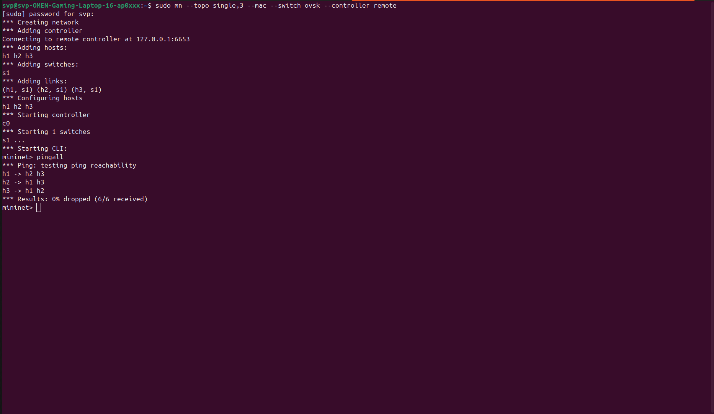
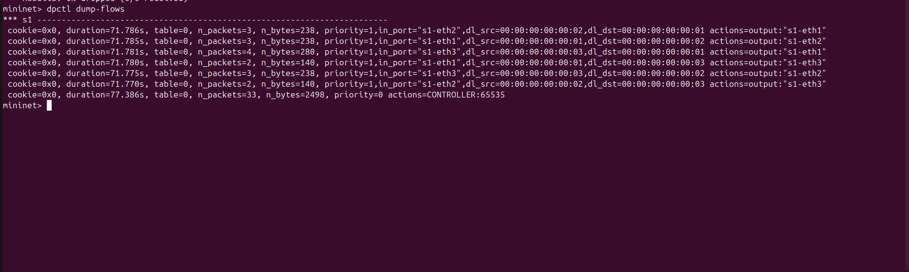

# SDN Learning Switch Controller

## Problem Statement
The objective of this project is to implement a Software-Defined Networking (SDN) controller that mimics a traditional learning switch. It dynamically learns the MAC addresses of connected hosts, maps them to switch ports, and installs forwarding rules onto the OpenFlow switch to route traffic efficiently without continuous flooding.

## Setup and Execution Steps
This project was built and tested using **Ubuntu 24.04**, **Python 3.10**, **Mininet**, and the **Ryu SDN Framework**.

**1. Start the Controller:**
Navigate to the project directory and run the Ryu application:
```bash
ryu-manager learning_switch.py

2. Start the Network Topology:
In a separate terminal, initiate Mininet with a single switch and 3 hosts, connected to the remote Ryu controller:
Bash

sudo mn --topo single,3 --mac --switch ovsk --controller remote


3. Trigger the Learning Logic:
Inside the Mininet CLI, force all hosts to communicate:
Bash

mininet> pingall


## Expected Output
* Upon the first packet transmission between unknown hosts, the controller will flood the packet and learn the source MAC address.
* Subsequent packets between known hosts will be forwarded directly via hardware rules, resulting in **0% packet loss** during the `pingall` test.
* The switch's internal flow table will reflect dynamic `priority=1` rules specifying source/destination MAC addresses and specific output actions.

## Proof of Execution
Below is the evidence of functional correctness and flow table inspection.

### 1. Functional Correctness (Ping Test)
*(The 0% packet loss demonstrates successful MAC learning and packet forwarding).*


### 2. Flow Table Inspection
*(The `dpctl dump-flows` output demonstrates dynamic flow rule installation by the controller).*

